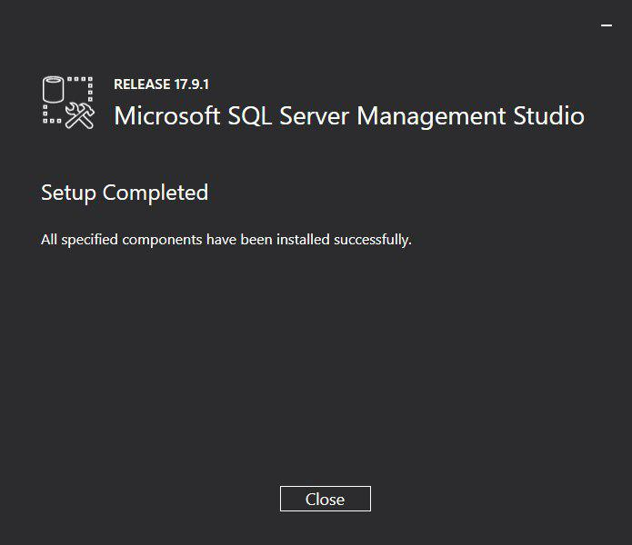

# Instalación de Microsoft SQL Server Management Studio

Proceso de instalación de la herramienta SSMS  en Windows.

> Para conectar de forma remota al servidor SQL Server consultar el siguiente [enlace](acceso-remoto-sqlserver).

## Mediante Chocolatey

1. Instalar el gestor de paquetes [Chocolatey](https://chocolatey.org/install).

2. Abrir un terminal (PowerShell o Símbolo del sistema) como Administrador.

3. Ejecutar el siguiente comando:

```bash
choco install -y sql-server-management-studio
```

## Mediante el instalador

1. Descargar el instalador desde el siguiente [enlace](https://go.microsoft.com/fwlink/?linkid=2043154) y ejecutarlo.

   

2. Pulsamos el botón "Install" para iniciar la instalación.

   

3. Y listo.

   

