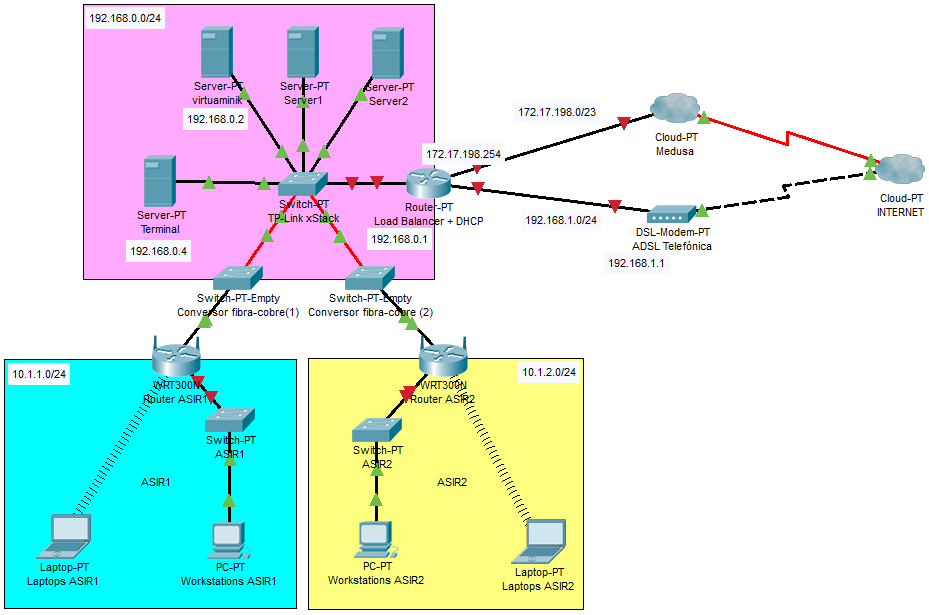

# Centro de Proceso de Datos

Documentación del CPD del IES Domingo Pérez Minik.

- Instalación de Xen Server 7.6

[XenServer download](https://www.citrix.com/downloads/citrix-hypervisor/)

- Instalación de Xen Center 7.2.0

Windows:  `choco install -y xencenter`

