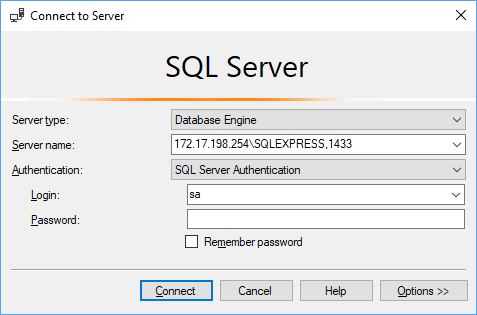

# Acceso remoto al servidor SQL Server del CPD

A continuación se explican los pasos para configurar el acceso remoto al servidor SQL Server del CPD Minikloud desde Management Studio:

> Sólo es posible el acceso desde la red del IES.

1. Iniciar Microsoft SQL Server Management Studio.

   

2. Pulsamos el botón para establecer la conexión al servidor (Connect Object Explorer).

   

3. Introducimos los siguientes datos de acceso:

   

    | Campo          | Descripción                                                  | Valor                            |
    | -------------- | ------------------------------------------------------------ | -------------------------------- |
    | Server type    | Tipo de servidor.                                            | `Database Engine`                |
    | Server name    | Cadena de conexión para el servidor en formato `IP\INSTANCIA,PUERTO`. | `172.17.198.254\SQLEXPRESS,1433` |
    | Authentication | Modo de autenticación.                                       | `SQL Server Authentication`      |
    | Login          | Nombre de usuario.                                           | `sa` (administrador)             |
    | Password       | Contraseña.                                                  | `*****`                          |

4. Pulsamos el botón "Connect" y ya estamos conectados.

   

