# Instalación y configuración de SQL Server

En este documento se describe cómo instalar SQL Server 2014 Express y configurarlo para que admita conexiones remotas.

> Este proceso se ha realizado en un Windows Server 2012 R2.

## Instalación

1. Instalar el gestor de paquetes [Chocolatey](https://chocolatey.org/docs/installation).

2. Instalar SQL Server Express y SQL Server Management Studio:

   ```powershell
   choco install -y mssqlserver2014express 
   choco install -y sql-server-management-studio
   ```

## Configuración

A continuación se explica cómo permitir conexiones remotas al servidor SQL Server recién instalado.

### Habilitar las conexiones remotas

1. Abrir **SQL Server Management Studio** y conectar a la instancia local de SQL Server.

   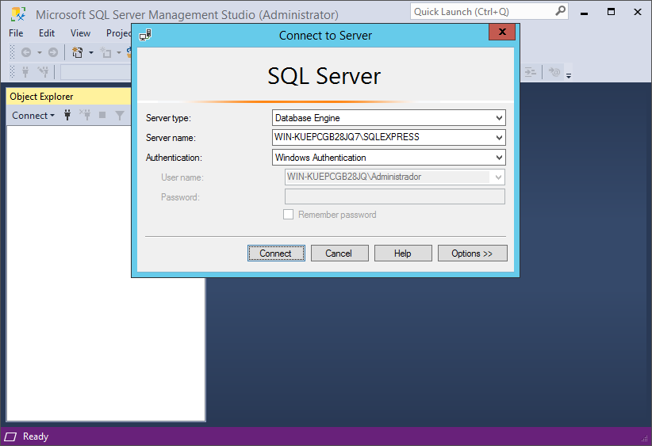

2. Hacer clic con el botón derecho del ratón sobre el nombre del servidory seleccionar "Properties".

   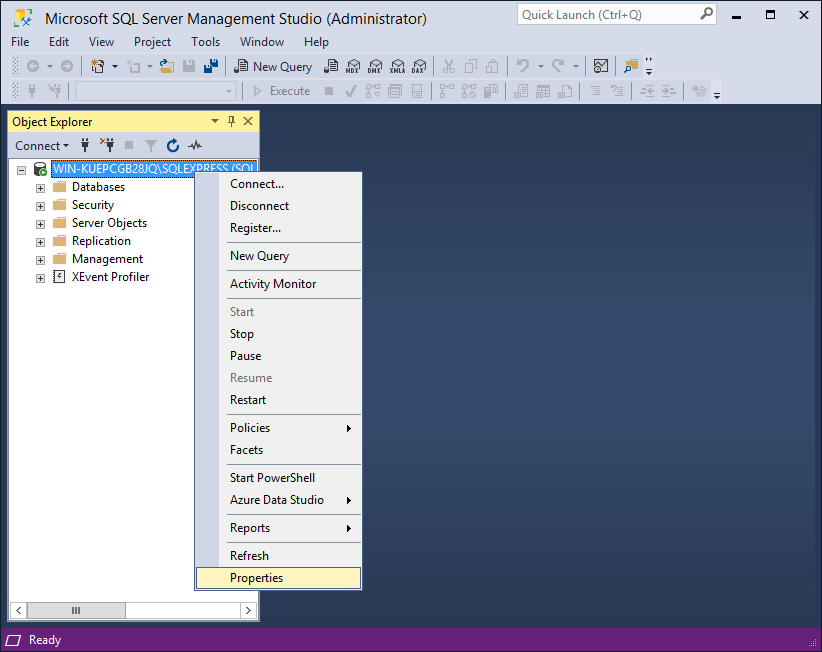

3. En el cuadro de diálogo "Server Properties", seleccionar la página "Connections" y activar "Allow remote connections to this server".

   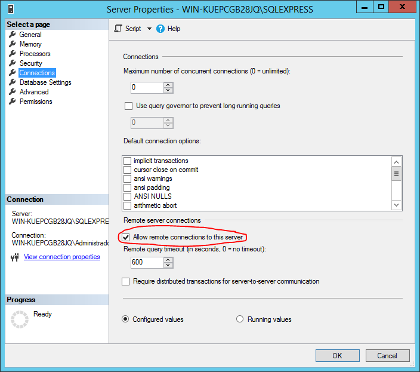

4. En el cuadro de diálogo "Server Properties", ahora seleccionamos la página "Security" y activamos "SQL Server and Windows Authentication mode" para poder iniciar sesión con los usuarios del SQL Server.

   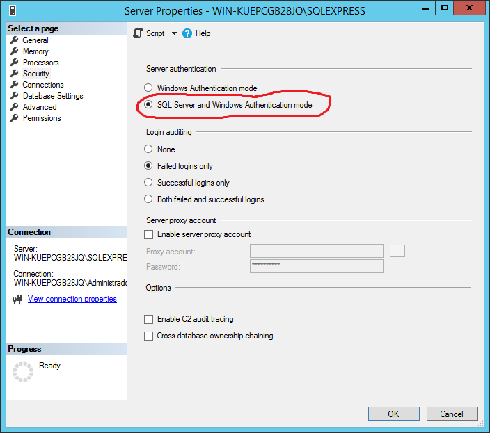

5. Pulsar "Ok" para guardar los cambios.

### Habilitar TCP/IP

1. Abrir **SQL Server Configuration Manager**.

   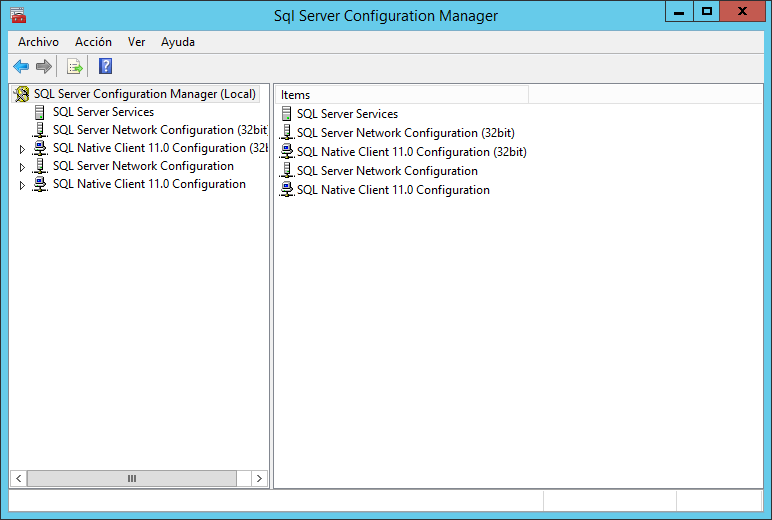

2. En "SQL Server Network Configuration" seleccionar "Protocols for [nombre de la instancia de SQL Server]".

3. En el panel de la derecha, activar "TCP/IP".

   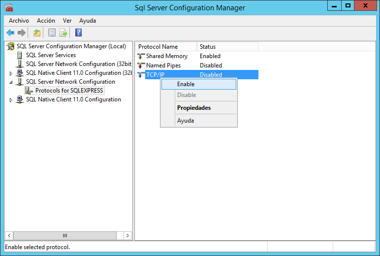
   
   > :warning: Tras hacer este cambio nos avisará que debemos reiniciar el servicio para que surta efecto, pero lo haremos más adelante.

### Habilitar el puerto 1433 para las conexiones remotas

1. Desde "SQL Server Configuration Manager", desplegamos "SQL Server Network Configuration" en el panel de la izquierda y seleccionamos "Protocols for [nombre de la instancia]".

2. En el panel de la derecha hacemos doble clic sobre "TCP/IP" y se abrirá el cuadro de diálogo "Propiedades: TCP/IP".

   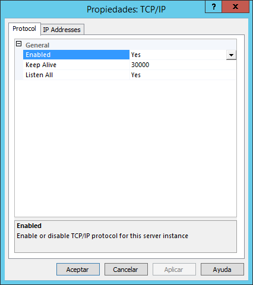

3. Seleccionamos la pestaña "IP Addresses", bajamos hasta "IPAll" y en "TCPPort" introducimos 1433.

   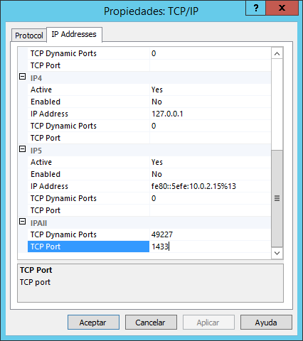
   
   > :information_source: De esta forma hacemos que SQL Server abra el puerto 1433 en todas las interfaces de red.

### Reiniciar el servicio

1. Seleccionar "SQL Server Services" en el panel de la izquierda.

2. En el panel de la derecha hacer clic con el botón derecho del ratón sobre el servicio "SQL Server ([nombre de la instancia])" y seleccionamos la opción "Restart".

   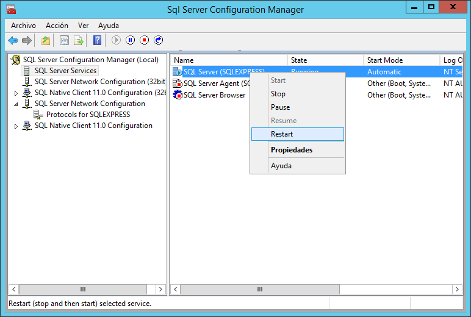

### Comprobar que el puerto 1433 está abierto

Ejecutamos el siguiente comando desde PowerShell para comprobar que el servidor se encuentra escuchando en el puerto 1433:

```power
Get-NetTCPConnection | Where-Object LocalPort -eq 1433
```
Se debe obtener el resultado que se muestra a continuación:

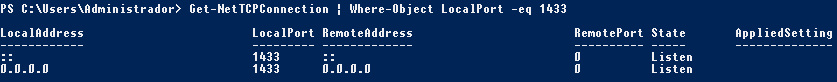

### Abrir el puerto 1433 en el Firewall

Ejecutamos el siguiente comando como Administrador desde PowerShell para añadir una regla en el Firewall que permita las conexiones TCP entrantes al puerto 1433:

```power
New-NetFirewallRule -DisplayName "SQLServer TCP 1433" –Direction inbound –LocalPort 1433 -Protocol TCP -Action Allow
```

>  :warning:En este punto ya es posible conectar de forma remota, el problema es que aún no disponemos de ningún usuario habilitado en el servidor para poder hacerlo.

### Habilitar la cuenta del usuario administrador de SQL Server

1. Abrir "SQL Server Management Studio" y conectar a la instancia local de SQL Server.

2. En el panel de la izquierda desplegar "Security" > "Logins".

   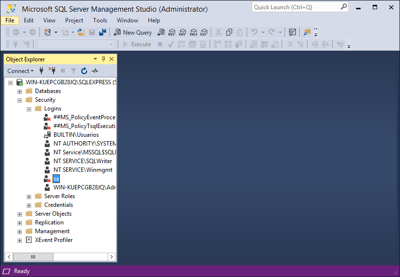
   
3. Hacemos doble clic sobre el usuario "sa" (SQL Server Administration account).

4. En la página "General" del cuadro de diálogo "Login Properties - sa" introducimos la contraseña del usuario "sa".

   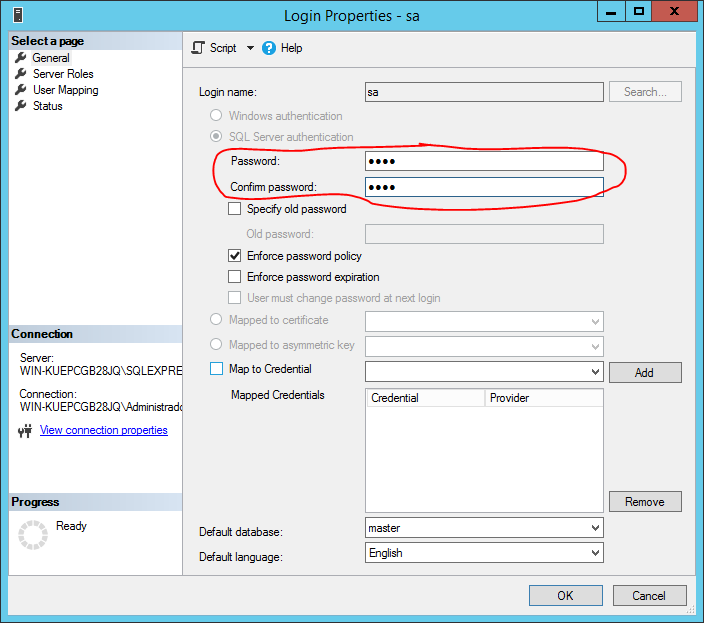

5. En la página "Status" seleccionamos "Enabled", para que el usuario pueda iniciar sesión.

   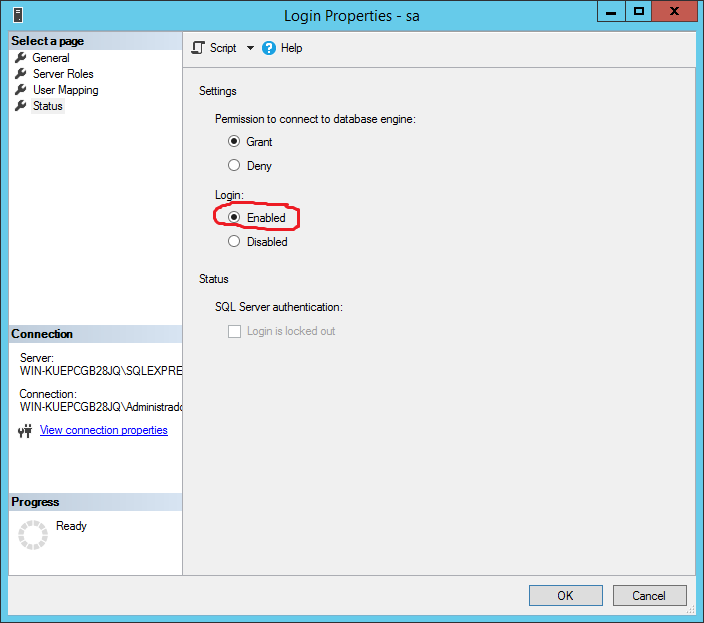
   
6. Pulsamos "Ok" para guardar los cambios.